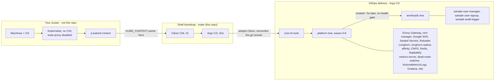

# offgrid

A self-hosted Kubernetes platform for a cluster you already have. [Cilium](https://cilium.io/) is the network, and
[Argo CD](https://argo-cd.readthedocs.io/) delivers everything else.


> The platform is everything that runs on a Kubernetes cluster: ingress, TLS, SSO, storage, databases, messaging,
> monitoring, backups, and a sample workload. Argo CD delivers it from this repo.
>
> This repo starts from a cluster that already exists. It does not build, upgrade or recover one. Any tooling can
> build your cluster, if the result meets [What this expects of your cluster](#what-this-expects-of-your-cluster).
> The defaults come from a small bare-metal [Talos Linux](https://www.talos.dev/) cluster. Every host-level
> assumption from that is a knob in `.env`.
>
> Every per-deployment value lives in `.env`. `make configure-values` writes those values into the chart values
> that Argo CD renders. So a fork changes one gitignored file and nothing else.
> To start, see [Make it your own](#make-it-your-own).

## Contents

- [The stack](#the-stack)
- [What this expects of your cluster](#what-this-expects-of-your-cluster)
- [What this does not do](#what-this-does-not-do)
- [Architecture](#architecture)
- [Getting started](#getting-started)
- [Make it your own](#make-it-your-own)
- [Day-2 operations](#day-2-operations)
- [Troubleshooting](#troubleshooting)
- [Documentation](#documentation)
- [Contributing](CONTRIBUTING.md)
- [License](#license) and [Credits](#credits)

## The stack

`01_cilium.sh` and `02a_argocd.sh` are the only imperative steps. Argo CD delivers everything after them. Each app
is a thin wrapper chart that pins its upstream version in its own `Chart.yaml`.

| Layer             | Component                      | Role                                                                                                         |
|-------------------|--------------------------------|--------------------------------------------------------------------------------------------------------------|
| Network           | Cilium                         | CNI and kube-proxy replacement. LB-IPAM and L2 announcements for LoadBalancer IPs. Node-to-node WireGuard. Hubble. |
| GitOps            | Argo CD                        | Delivery engine. Manages itself after bootstrap. Two trees of apps: platform and workloads.                  |
| Ingress           | Envoy Gateway                  | Gateway API data plane. One Envoy on one pinned LoadBalancer IP.                                             |
| TLS               | cert-manager                   | Let's Encrypt certificates from ClusterIssuers. HTTP-01, plus Cloudflare DNS-01 for wildcards.               |
| Auth              | Google SSO                     | One central OIDC login: one Envoy `SecurityPolicy`, one email allowlist, gating per host.                    |
| Secrets           | Sealed Secrets                 | Encrypted secrets committed to git.                                                                          |
| Config reload     | Reloader                       | Restarts a workload when a ConfigMap or Secret it mounts changes. Kubernetes never does this by itself.      |
| Storage           | Longhorn                       | Replicated block storage for everything stateful, so a volume outlives the machine under it.                 |
| Node health       | dead-node-watcher              | Custom Deployment. Taints a node that is really dead, which cuts volume handover from about 6 min to about 2. |
| Data locality     | longhorn-replica-affinity      | Mutating webhook. Schedules a pod onto a node that already holds its Longhorn replica, so its IO stays off the network. |
| Database          | CloudNativePG                  | Kubernetes-native PostgreSQL operator.                                                                       |
| Cache             | OpsTree Redis operator         | Standalone Redis instances, one for each workload alias.                                                     |
| Messaging         | RabbitMQ                       | One shared broker. Each workload declares its own topology.                                                  |
| Metrics API       | metrics-server                 | `metrics.k8s.io` for `kubectl top` and HPAs.                                                                 |
| Observability     | VictoriaMetrics, VictoriaLogs  | PromQL-compatible metrics and logs backend. Chosen over Prometheus, Mimir and Loki to fit 8 GB nodes.        |
| Observability     | Grafana                        | Dashboards and alerting, provisioned as code. No persistent storage.                                         |
| Alerting          | ntfy                           | Self-hosted mobile push. No email.                                                                           |
| Observability     | blackbox-exporter              | Probes every ingress host by its public name. It catches a broken edge before users send traffic.            |
| Workloads         | sample-user-manager and 2 more | Demo app with Postgres, Redis, messaging, and open and SSO ingress. The template for real workloads.         |

Five shared charts under `lib/helm/` are `file://` dependencies of other charts. All are `type: application`:

- `ingress`: the ingress edge (Gateway, HTTPRoute, ReferenceGrant, Certificate) from an `ingresses[]` list
- `pg-cluster`: a curated CloudNativePG Postgres wrapper
- `redis-instance`: a curated standalone OpsTree Redis wrapper
- `rabbitmq-topology`: the messaging topology of one workload on the shared broker
- `nfs-volume`: static PVs and PVCs for NFS exports that already exist off-cluster, from a `volumes[]` list

## What this expects of your cluster

This repo installs the CNI and everything above it. The cluster underneath must meet the list below. Each row
says what to change when your cluster differs. The knobs live in `.env`, and `make configure-values` writes them
into the chart values.

| Requirement | Why | If your cluster differs |
|---|---|---|
| The API reachable at `KUBE_API_HOST:KUBE_API_PORT` from every node | Cilium runs `kubeProxyReplacement`, so it needs the API before pod networking exists | Set both in `.env`. The default `localhost:7445` is Talos KubePrism. Elsewhere, use your API endpoint or a node-local proxy |
| No CNI installed, kube-proxy disabled | Cilium provides both. Nodes stay `NotReady` until `01_cilium.sh` runs, and that is expected | If your distribution ships a CNI, remove it first. Or skip `01_cilium.sh` and adapt the Cilium values so the two coexist |
| `iscsid`, `fstrim` and an NFSv4 client on every node | Longhorn attaches volumes over iSCSI and trims them. It mounts an RWX volume over NFS. `lib/helm/nfs-volume` mounts off-cluster exports over NFS too | Install `open-iscsi`, `util-linux` and `nfs-common`. Other distributions name the last one `nfs-utils` or `nfs-client`. On an immutable OS, add the equivalent extensions. Talos has the NFS client in the kernel. `kubectl get nodes.longhorn.io -n longhorn-system` reports all three as conditions |
| A filesystem at `LONGHORN_DATA_PATH`, bind-mounted into the kubelet with `rshared` | Longhorn creates one sub-mount per replica, and the kubelet must see them | Any path works. The Longhorn default is `/var/lib/longhorn`. With a containerized kubelet, the mount propagation must be bidirectional |
| A kernel with 4K pages | Longhorn and XFS fail with 16K pages | Almost every distribution uses 4K. Only SBC kernels built with 16K pages are a concern |
| Namespaces can carry `pod-security.kubernetes.io/enforce: privileged` | Longhorn, Cilium and the node agents need privileged pods | The app manifests set the label themselves. Act only if a policy engine overrides them |
| Kubelets with self-signed certs and no CSR approver | metrics-server cannot verify the kubelet identity, so it does not try | Set `KUBELET_TLS_INSECURE=false` if a CA that the apiserver trusts signs your kubelet certs |
| Control-plane metrics reachable on each node, etcd on `ETCD_METRICS_PORT` | The monitoring stack scrapes controller-manager, scheduler and etcd directly | Exposing them is a host-level change. If you cannot, set `enabled: false` on those three in `05_victoria_metrics_k8s_stack` |
| 3 or more nodes | Longhorn runs 2 replicas with hard anti-affinity, so it needs a spare node to rebuild onto | 2 nodes work but leave no spare. 1 node needs a lower replica count and relaxed anti-affinity |
| An S3 bucket, optional | Off-cluster backups | Leave the `AWS_DEPLOY_*` keys empty, and every backup step is skipped |

The platform also assumes two things without a knob. Each is a one-line edit if it is wrong for you:

- **Node system logs are files under `/var/log`.** The log collector tails them. A journald distribution has no
  such files. There, drop that `fileCollector` entry in `05_victoria_logs/values.yaml` and collect from journald.
- **Node filesystems are `ext4` or `xfs`.** The disk-usage alerts filter on these types to skip the many tmpfs
  mounts of an immutable OS. If yours differ, edit the regex in `05_grafana/files/alerts/cluster-health.yaml`.

The platform assumes no CPU architecture. `make check-multiarch` checks that every running image has a manifest
for every architecture in the cluster. Pass `ARCH=` to check before a node of a new architecture joins.

## What this does not do

This repo does not build, configure, upgrade or recover the machines. It does no node provisioning, no OS config,
no etcd management and no kubelet upgrades. Your own tooling does that, and this repo never talks to it.

Three make targets let the two sides cooperate without knowing each other:

| Target | Use |
|---|---|
| `make check-replication-health` | Exits non-zero until Longhorn, CNPG and RabbitMQ are healthy and in sync. Point the pre-drain gate of your node tooling at it. Then a rolling reboot never takes the last healthy replica of a volume |
| `make evacuate-node NODE=<host>` | Moves any Postgres primary off that node. Point the pre-drain evacuate hook of your tooling at it. A primary that is force-killed during a drain can fail `pg_rewind` and never rejoin |
| `make reconcile-storage NODE=<host>` | Run it after your tooling rejoins a replaced machine. Longhorn records a disk UUID that a reflash makes invalid, and nothing else fixes it |

None of them is required. Without them, node maintenance still works, but without these safety checks.

## Architecture

The shell bootstrap only gets the cluster to Argo CD. From there, git is the source of truth. Sync-waves order
creation only, with no health gate, and unbounded retry converges an app that started too early. See
[02_gitops](docs/02_gitops.md).



## Getting started

Prerequisite: a running Kubernetes cluster that meets
[What this expects of your cluster](#what-this-expects-of-your-cluster), and a kubectl context for it.

`KUBE_CONTEXT` in `.env` pins the cluster this repo may touch, never your currently selected context. Your
`~/.kube/config` can hold work clusters too, and nothing here is read-only. Leave it empty, and the first run asks
you to pick a context and saves it.

The scripts were only tested on macOS, so Linux or WSL can need changes. They expect bash or zsh, GNU `make`, and
a POSIX-like environment. Install `git`, `kubectl`, `helm`, `yq` and `kubeseal` on your machine.

```bash
# 1. Configure
cp .env.example .env                # then check every value: KUBE_CONTEXT, repo URL, domains, ingress IP, secrets

# 2. Recommended: point `secrets/` at storage that outlives this checkout
ln -s /path/to/your/synced/store secrets   # if you skip this, bootstrap creates a plain gitignored dir and warns you

# 3. Install the platform
make bootstrap-cluster              # CNI, write values, push, Argo CD, seal secrets, wait for convergence

# 4. Verify
kubectl get applications -n argocd  # watch Argo CD deliver the platform, then the workloads
make view-credentials               # login URLs and credentials
```

Instead of `make bootstrap-cluster`, you can run the steps one by one. `make help` lists every target in step
order.

## Make it your own

Fork the repo. Then edit one gitignored file, copied from a committed template:

```bash
cp .env.example .env                 # repo URL, domains, ingress IP, secrets
make configure-values                # writes it into every chart value that Argo CD renders
git add -A && git commit && git push # Argo CD reconciles the remote, never your working tree
```

`make configure-values` is idempotent. Run it again after any change to `.env`.

`.env.example` explains every key. Every secret is optional: an empty one turns off the feature it enables. The
list of SSO-gated hosts is policy, not config, so it lives in `argo_apps/platform/charts/04_google_sso`.

## Day-2 operations

| Task                        | Command                                                                |
|-----------------------------|------------------------------------------------------------------------|
| Re-apply `.env` to charts   | `make configure-values`                                                |
| Restore a datastore         | `make restore-cnpg`, `restore-redis`, `restore-longhorn`, `restore-vm` |
| Rightsize requests          | `make krr`                                                             |
| Rotate the SSO client       | `make configure-sso`                                                   |
| Re-seed ntfy auth           | `make configure-ntfy-auth`                                             |
| Back up the sealing key     | `make backup-secrets-key`                                              |
| Redeliver the whole platform| `make rebuild-cluster`                                                 |
| Credentials and login URLs  | `make view-credentials`                                                |

The tooling that built the nodes owns all node work. [What this does not do](#what-this-does-not-do) lists the
targets where that tooling and this repo meet.

## Troubleshooting

- **Nodes are `NotReady`:** expected until the Cilium CNI is installed (`make install-cilium`, step 01).
- **An Argo CD app is `OutOfSync` or reports "path does not exist":** you did not push. Commit and push
  `argo_apps/**`, and any `Chart.lock` with it ([docs/02](docs/02_gitops.md)).
- **An app stays `OutOfSync` and nothing looks wrong:** Argo CD keeps a stateful CR that you removed from a live
  app, and does not prune it. The permanent `OutOfSync` is the signal ([docs/10](docs/10_backups.md)).
- **A LoadBalancer IP stays `<pending>`:** `INGRESS_LB_IP` must be in the Cilium LB pool and on the L2 network of
  the nodes. It must not be in the DHCP range or be the VIP ([docs/01](docs/01_networking.md)).
- **A gated host loops through Google forever:** its subdomain must be under the domain it is listed against.
  Each SSO policy sets one cookie domain ([docs/04](docs/04_ingress.md)).
- **`make bootstrap-cluster` refuses to start:** it found no reachable cluster. Build one first, and point
  `KUBE_CONTEXT` at it ([What this expects of your cluster](#what-this-expects-of-your-cluster)).

## Documentation

Each doc records the decisions behind one area. Procedures live in `docs/runbooks/`, under the same `NN` as the
decision doc.

| Doc                                                | Covers                                                                          |
|----------------------------------------------------|---------------------------------------------------------------------------------|
| [01_networking](docs/01_networking.md)             | Cilium as CNI, LoadBalancer and WireGuard. The last imperative infra step.      |
| [02_gitops](docs/02_gitops.md)                     | Argo CD, the two trees of apps, the sync-wave convention.                       |
| [03_secrets](docs/03_secrets.md)                   | Sealed Secrets, and custody of the master key you must not lose.                |
| [04_ingress](docs/04_ingress.md)                   | Envoy Gateway, cert-manager, Let's Encrypt, central Google SSO.                 |
| [05_storage](docs/05_storage.md)                   | Longhorn, why nothing is node-local, CloudNativePG.                             |
| [06_monitoring](docs/06_monitoring.md)             | VictoriaMetrics, VictoriaLogs, Grafana, alerting, metrics-server.               |
| [07_sample_workload](docs/07_sample_workload.md)   | An end-to-end app with Postgres behind the Gateway.                             |
| [08_messaging](docs/08_messaging.md)               | The shared RabbitMQ broker and the topology chart for each workload.            |
| [09_redis](docs/09_redis.md)                       | Standalone Redis instances, persistence modes, resizing.                        |
| [10_backups](docs/10_backups.md)                   | Off-cluster S3 backups for Postgres, Redis, Longhorn and the monitoring stores. |
| [11_renovate](docs/11_renovate.md)                 | Automated dependency updates, and when Renovate may merge by itself.            |
| [12_storage_bench](docs/12_storage_bench.md)       | What Longhorn with 2 replicas costs CNPG and RabbitMQ in write latency.         |
| [13_node_loss](docs/13_node_loss.md)               | What the workloads do when a machine dies, measured, and how to reconcile a replaced one. |
| [14_igpu](docs/14_igpu.md)                         | The Intel iGPU: what the driver needs, how a pod claims it, and why no NFD.     |
| [15_replica_affinity](docs/15_replica_affinity.md) | Scheduling pods onto the node that already holds their Longhorn replica.        |

[CONTRIBUTING.md](CONTRIBUTING.md) holds the repository layout and the conventions for the whole repo.

## Credits

Built on the work of the [Cilium](https://cilium.io/),
[Argo CD](https://argo-cd.readthedocs.io/), [cert-manager](https://cert-manager.io/),
[Envoy Gateway](https://gateway.envoyproxy.io/), [Sealed Secrets](https://github.com/bitnami-labs/sealed-secrets),
[Longhorn](https://longhorn.io/), [CloudNativePG](https://cloudnative-pg.io/),
[VictoriaMetrics](https://victoriametrics.com/) and [Grafana](https://grafana.com/) communities.

## License

MIT. See [LICENSE](LICENSE).
